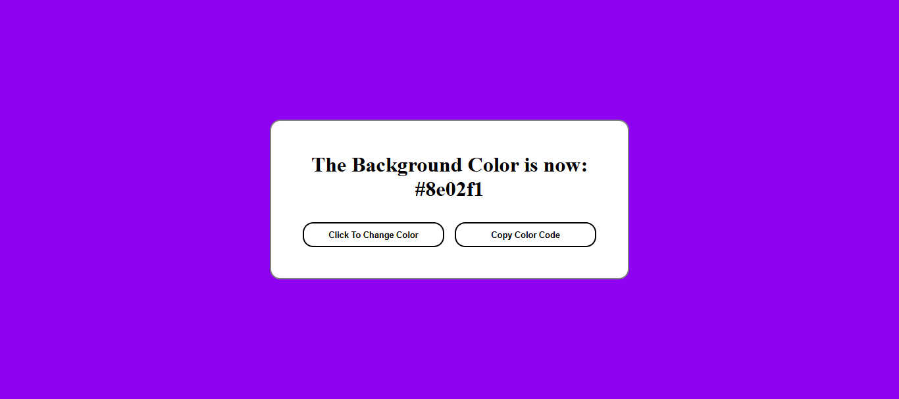

# Color Flipper 🎨

A beginner-friendly JavaScript project that dynamically changes the background color of a webpage each time a button is clicked. It also displays the current color code on the screen in real-time!

## 🚀 Features

- Built with HTML, CSS, and JavaScript
- Random hex color generator
- Click to change background color
- Real-time display of the current color code
- Clean, responsive, and interactive UI

## 📸 Preview

## 🎯 Purpose

This project is perfect for beginners who want to practice:

- DOM manipulation
- Event handling in JavaScript
- Generating random values
- Updating the UI dynamically

## 🛠️ How It Works

1. A random hex color is generated on each button click.
2. The background color of the page updates instantly.
3. The color code is shown on-screen, and you can copy it too.

## 🧑‍💻 Tech Stack

- HTML5
- CSS3
- JavaScript (Vanilla)

## 📂 Folder Structure

color-flipper/

├── index.html

├── style.css

├── script.js

└── screenshot.png

## 🔗 Live Demo

[Watch the full tutorial on YouTube](https://youtube.com/@DevCraftProjects)

## 📌 Author

**Syed Muhammad Talha** – [@DevCraftProjects](https://github.com/syed-muhammad-talha)

---

Feel free to ⭐ the repo and share if you find it helpful!
